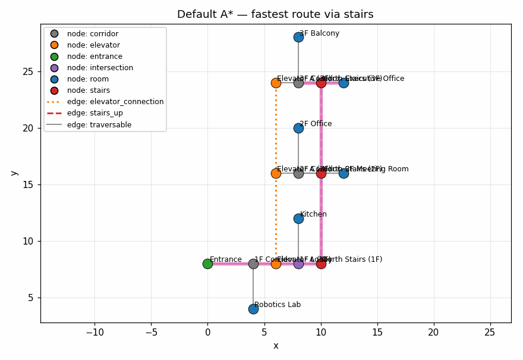
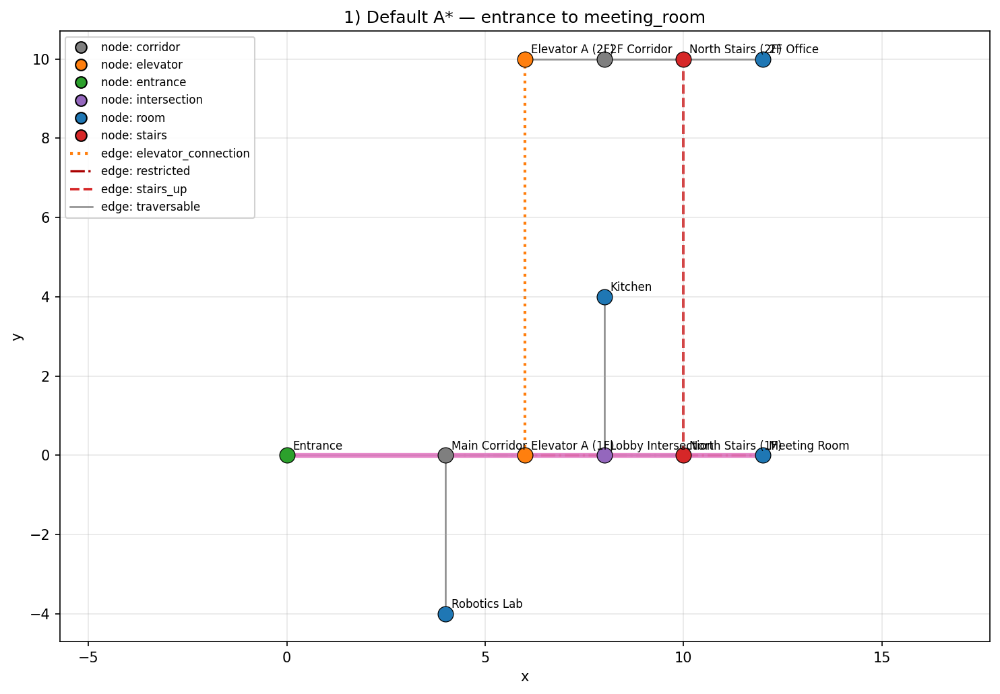
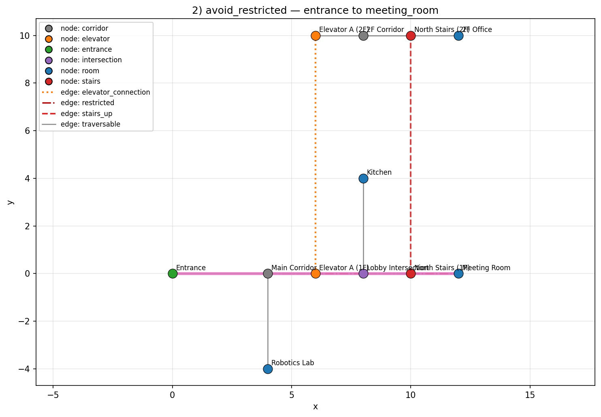
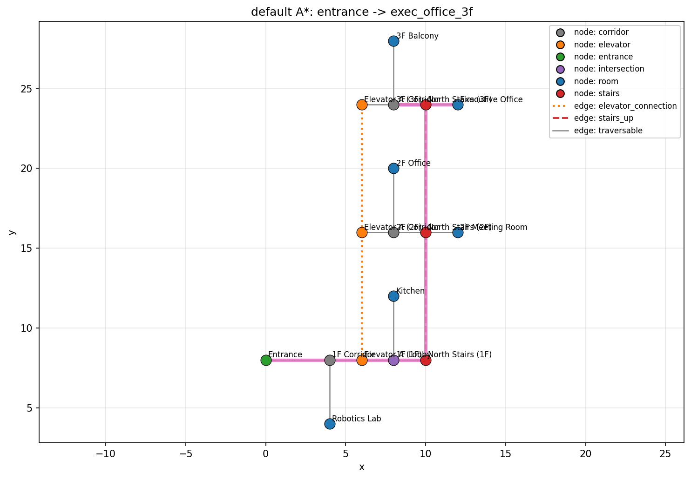
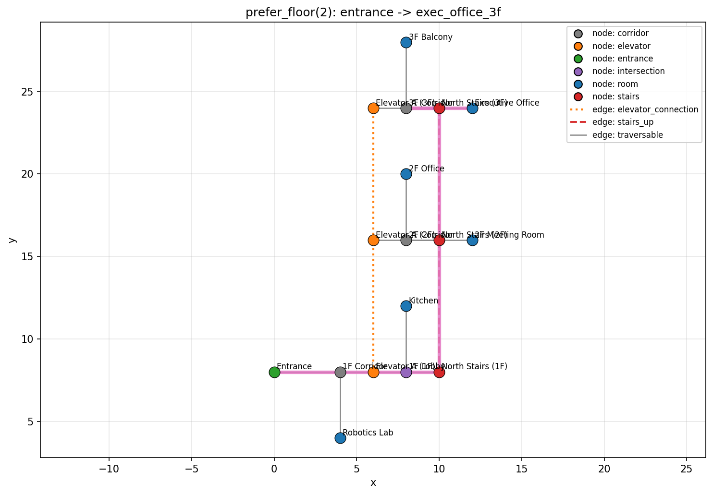
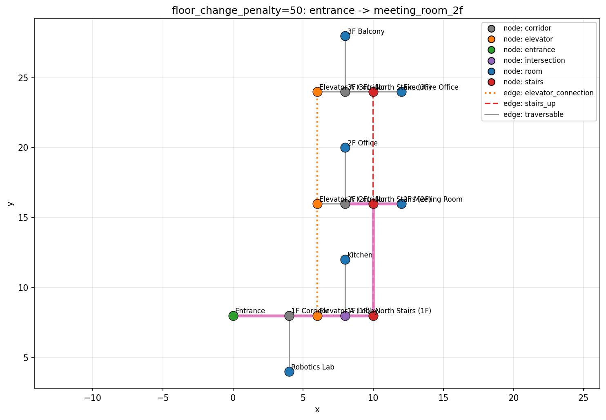
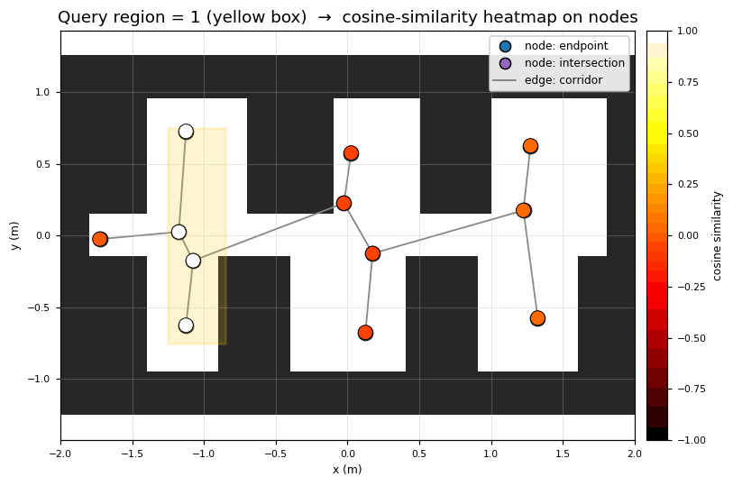
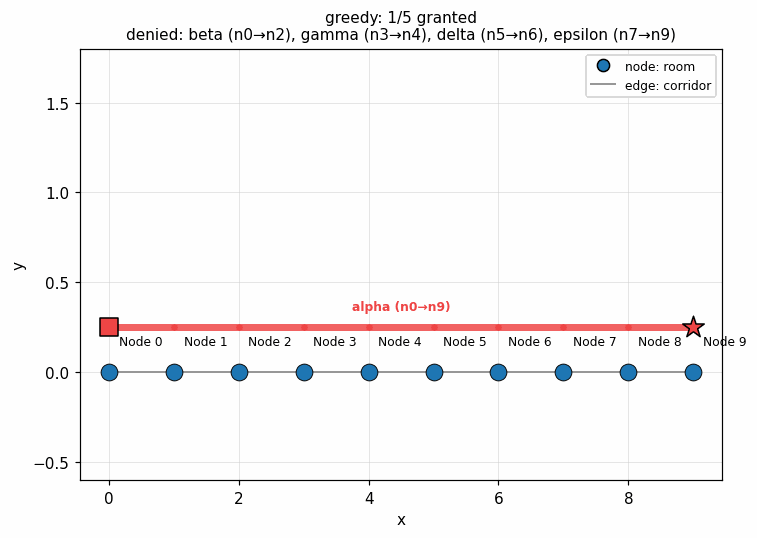

# semantic-toponav

[](https://github.com/rsasaki0109/semantic-toponav/actions/workflows/test.yml)
[](https://www.python.org/downloads/)
[](LICENSE)

**Grounded middle planning layer for robot navigation.** Bridges
dense maps (SLAM / occupancy / HD) and motion executors (Nav2 /
Autoware / MPPI / learned policies) with a graph-level layer that
decides *where to go, why, and who first* — under language goals,
calendar-aware closures, soft preferences, deadlines, and multi-agent
reservations. Pure-Python core, zero hard dependencies, full Protocol
conformance suites.

<p align="center">
  
</p>

<p align="center">
  <sub>Same 3-floor graph, four cost configurations: default A* → prefer_elevator → floor_change_penalty → same_floor_only.</sub>
</p>

---

## What it does

Three orthogonal axes, all composable:

### Plan
Routes on semantic graphs with composable cost rules. `compose_costs`
stacks `avoid_stairs` / `prefer_elevator` / `block_edges` /
`time_aware` / `preference_aware` / `reservation_aware` /
`floor_change_penalty` and a dozen others into a single A* call. No
re-implementations per scenario — declare what you want, the planner
honors it.

### Coordinate
Multi-agent fleets with atomic reservations and **seven strategies**:
`greedy` / `priority` / `deadline` / `joint` / `bnb` (branch-and-bound,
3 objectives) / `exhaustive` (MIS upper bound) / `insert`
(insertion-based repair). Hard deadline admission with a structured
`reason_code` so denials are explainable. Optional in-process or HTTP
scheduler for fan-out across processes.

### Resolve
Natural-language goals → node ids. The deterministic floor
(bag-of-words + floor parsing) always runs first; an LLM may rewrite
prose or re-rank the top-k pool but **cannot invent node ids** —
out-of-pool picks silently fall back. Multi-turn `DialogSession` for
ambiguous queries; optional CLIP / VLM cosine retrieval for
embedding-grounded resolves.

---

## Quick start

```bash
pip install -e .
semantic-toponav plan          examples/indoor_office.yaml entrance meeting_room
semantic-toponav waypoints     examples/indoor_office.yaml entrance office_2f --avoid-stairs --prefer-elevator
semantic-toponav describe-path examples/indoor_office.yaml entrance office_2f --avoid-stairs --prefer-elevator
```

```python
from semantic_toponav.graph.serialization import load_graph
from semantic_toponav.planner import (
    plan_astar, avoid_stairs, prefer_elevator, compose_costs,
)
from semantic_toponav.waypoint import path_to_semantic_waypoints

graph = load_graph("examples/indoor_office.yaml")
path = plan_astar(graph, "entrance", "office_2f",
                  cost_fn=compose_costs(avoid_stairs, prefer_elevator))
for wp in path_to_semantic_waypoints(graph, path):
    print(wp.instruction)
```

New here? Walk through the
[**three-floor tutorial**](docs/tutorial.md) end-to-end.

---

## Gallery

### Cost composition

The same graph re-planned under different cost stacks. The path
changes; nothing about the graph does.

| default A* | + avoid_stairs + prefer_elevator |
|---|---|
|  |  |

| default to meeting room | + restricted-edge avoidance |
|---|---|
|  |  |

### Multi-floor planning

`floor_change_penalty`, `prefer_floor`, `same_floor_only`, and a
`floor_aware_heuristic` make multi-storey layouts a first-class
target — no per-floor sub-graphs needed.

| default (cheapest stairs route) | prefer_elevator |
|---|---|
|  |  |

| prefer_floor=2 (bias toward 2F) | floor_change_penalty (avoid hopping floors) |
|---|---|
|  |  |

### Conversion pipeline

Topology graphs can be authored by hand or **generated from
existing artifacts**: occupancy grids via skeletonization +
clearance-aware door detection + region segmentation, or trajectory
logs (CSV / rosbag2) via greedy clustering.

| occupancy grid → topology | path on the auto-generated graph |
|---|---|
|  |  |

| trajectory log → topology | CSV trajectory (no pandas) |
|---|---|
|  |  |

### VLM region embedding

After `annotate_regions` carves a graph into rooms,
`embed_region_patches` stamps an encoder vector onto every node in
each region (CLIP, Hashing, or any
[`Backend`](docs/conformance.md)-conforming adapter). At query time
the same vector can be used to retrieve nodes by cosine similarity —
the same wire format the LLM resolver consumes as
`embedding_score=` context.

<p align="center">
  
</p>

<p align="center">
  <sub>Three query regions, three different highlight patterns. The
  example uses the dependency-free <code>HashingBackend</code>; swap in
  <code>CLIPBackend</code> + an <code>AlignedRgbSource</code> to ground
  text queries on real photographs. Reproduce via
  <code>python examples/vlm_region_embedding_demo.py</code>.</sub>
</p>

### Multi-agent coordination

The same scheduler under four ordering strategies. The scenario is
intentionally adversarial — a long-haul agent is submitted first, so
naive greedy locks every other agent out (1/5 granted). Branch-and-
bound and the exhaustive MIS baseline reorder the queue and fit four
short-haul agents into disjoint segments (4/5 granted).

<p align="center">
  
</p>

<p align="center">
  <sub>greedy / priority → 1/5 (only the long-haul fits). bnb /
  exhaustive → 4/5 (long-haul denied, four shorts fit). Reproduce via
  <code>python examples/coordination_strategies_demo.py</code>. Static
  2x2 reference: <code>docs/images/16_coordination_strategies.png</code>.</sub>
</p>

---

## Features

| Area | What's there | Docs |
|---|---|---|
| **Map / log conversion** | Occupancy grid, door detection, region segmentation, graph compaction, trajectories, CSV / rosbag2 / ROS map_server | [conversion.md](docs/conversion.md) |
| **Cost composition** | `avoid_*` / `prefer_*` / `block_*`, time-of-day windows, calendar-aware closures, soft preferences (node / edge), static reservations, multi-floor heuristics | [cost_composition.md](docs/cost_composition.md) |
| **Multi-agent coordination** | `SharedScheduler` + RPC shim (HTTP / custom), `plan_fleet_with_strategy` (7 strategies), branch-and-bound + fairness objectives, exhaustive-MIS upper bound, insertion-based repair, deadline admission, scheduler persistence, synthetic eval suite | [coordination.md](docs/coordination.md) |
| **Semantic queries + LLM/VLM** | `find_nodes` / `nearest_*` / `resolve_goal`, embedding retrieval, CLIP backend, `llm_resolve_goal` + `DialogSession` (multi-turn), mid-traversal describer rewrite, visit-history memory | [queries.md](docs/queries.md) |
| **CLI reference** | All subcommands and flags | [cli.md](docs/cli.md) |
| **Visualization** | matplotlib `plot`, interactive pyvis HTML viewer, live-reloading viewer | see below |
| **Schema** | YAML v1 graph format + six v1-locked JSON wire schemas (waypoint array, plan / fleet result, conflict explanation, resolve trace, preference metadata) | [schema_v1.md](docs/schema_v1.md) · [waypoint_schema.md](docs/waypoint_schema.md) |
| **Protocol conformance** | Reusable suites under `semantic_toponav.testing.conformance` for `LLMBackend` / encoder `Backend` / `AlignedRgbSource` / `SchedulerProtocol` / `Transport` / `ConflictPolicy` with failure-mode depth | [conformance.md](docs/conformance.md) |
| **Language-grounding eval** | YAML gold-corpus driver for `resolve_goal` / `llm_resolve_goal` (precision@1, top-k recall, clarification / fp-resolve / abstention rates) + describer-rewrite safety invariants for `llm_describe_path` | [eval_grounding.md](docs/eval_grounding.md) |
| **ROS2 integration** | `graph_loader` / `waypoint_publisher` / `nav2_demo` nodes | [ros2/README.md](ros2/README.md) |

---

## Visualization

```bash
pip install -e '.[viz]'
semantic-toponav plot examples/indoor_office.yaml \
    --start entrance --goal office_2f \
    --avoid-stairs --prefer-elevator --save route.png

pip install -e '.[viz_web]'
semantic-toponav viewer examples/multi_floor_office.yaml \
    --start entrance --goal exec_office_3f --prefer-elevator \
    --output viewer.html

semantic-toponav live-viewer examples/multi_floor_office.yaml
```

The web viewer is a fully offline self-contained HTML file — nodes
are draggable, hovering surfaces type / cost / property tooltips,
and the highlighted path is overlaid in pink. `live-viewer` adds a
file-watch loop so edits to the YAML reload the browser tab.

---

## Graph schema (v1)

```yaml
version: 1
metadata: {name: indoor_office, frame_id: map}
nodes:
  - id: entrance
    label: Entrance
    type: entrance
    pose: {x: 0.0, y: 0.0, yaw: 0.0, frame_id: map}
    properties: {}
edges:
  - id: entrance_to_corridor
    source: entrance
    target: corridor_main
    type: traversable
    cost: 1.0
    bidirectional: true
    properties: {}
```

Node `type` examples: `corridor`, `room`, `intersection`, `elevator`,
`stairs`, `entrance`. Edge `type` examples: `traversable`,
`stairs_up`, `stairs_down`, `elevator_connection`, `restricted`,
`one_way`. `pose` is optional — without it A* degrades to Dijkstra.

For a fluent builder API, see `semantic_toponav.graph.GraphBuilder`
(documented in [tutorial.md](docs/tutorial.md)).

---

## What this project is *not*

Deliberately out of scope (use existing systems):

- Low-level control (MPC / MPPI)
- Obstacle avoidance / SLAM / dense occupancy planning
- Behavior trees
- Head-to-head MAPF solver on gridworld (that's CBS / EECBS / MAPF-LNS2
  territory; this layer sits above pure grid MAPF and adds semantic /
  time / language constraints instead)

The split is *where to go* (this repo) vs *how to move locally*
(Nav2 / Autoware / your motion executor):

| Layer | Responsibility | Owned by |
|---|---|---|
| Global semantic-topological planning | *where* / *why* / *who first* | this repository |
| Local motion execution | *how to move locally* | Nav2 / MPPI / policy |

---

## Status

Feature-complete across the original roadmap and the 25-PR post-MVP
arc: synthetic eval suite, branch-and-bound + fairness objectives,
HTTP transport, exhaustive MIS baseline, scheduler persistence, public
Protocol conformance suites with failure-mode depth, calendar-aware
closures, soft preferences (edge + node defaults), mid-traversal LLM
rewrites, insertion-based fleet repair, language-grounding eval suite,
and v1.0 schema lock across six wire formats. See
[docs/decisions.md](docs/decisions.md) for design notes,
[docs/experiments.md](docs/experiments.md) for the full feature index,
and [docs/paper_outline.md](docs/paper_outline.md) for the working
outline of the paper that organizes the post-MVP arc.

Six public wire formats are **v1-locked** under [`schemas/`](schemas/):
`SemanticWaypointArray` (waypoint publisher),
`PlanWithSchedulerResult` + `FleetPlanResult` (fleet admission),
`ConflictExplanation` (CBS-lite diagnostics), `ResolveTrace`
(language grounding), and the `preferences` metadata convention. See
[docs/schema_v1.md](docs/schema_v1.md) for the freeze policy and
[CHANGELOG.md](CHANGELOG.md) for the consolidated v1.0 release
notes spanning PR #1–#62.

---

## Tests

```bash
pytest -q                              # 875 tests, ~20s
ruff check .
```

## License

Apache-2.0.
