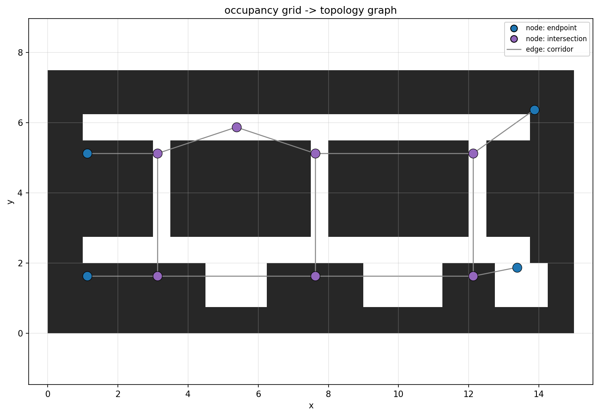
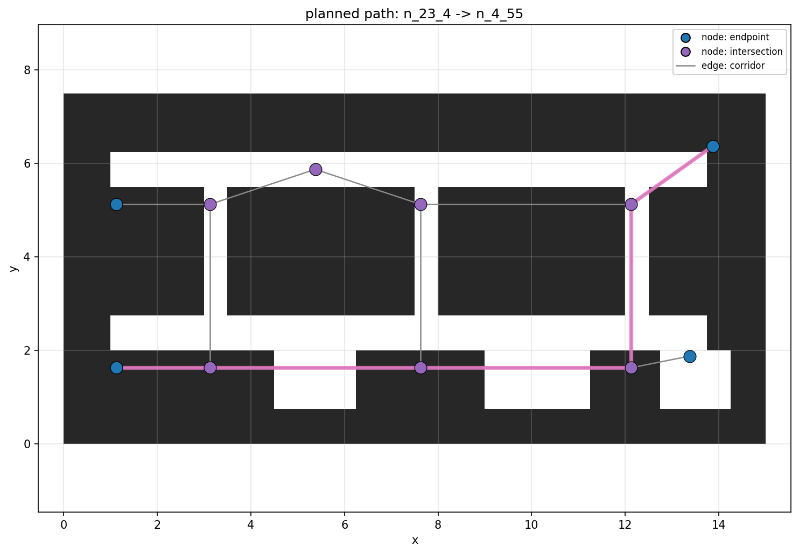
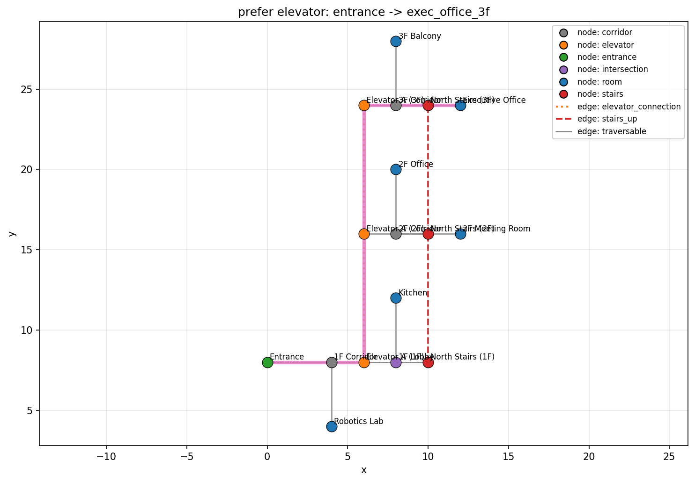
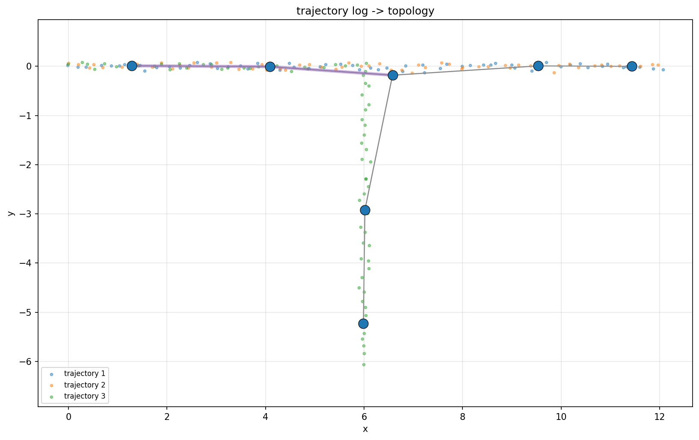
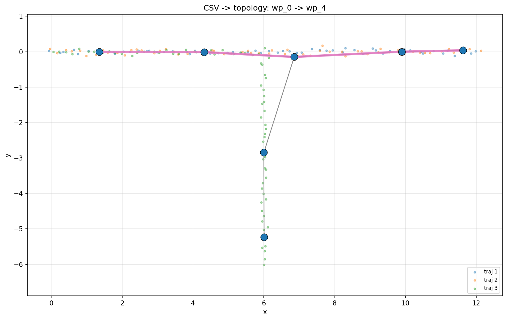
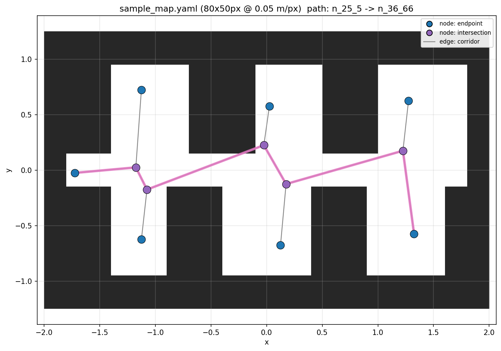
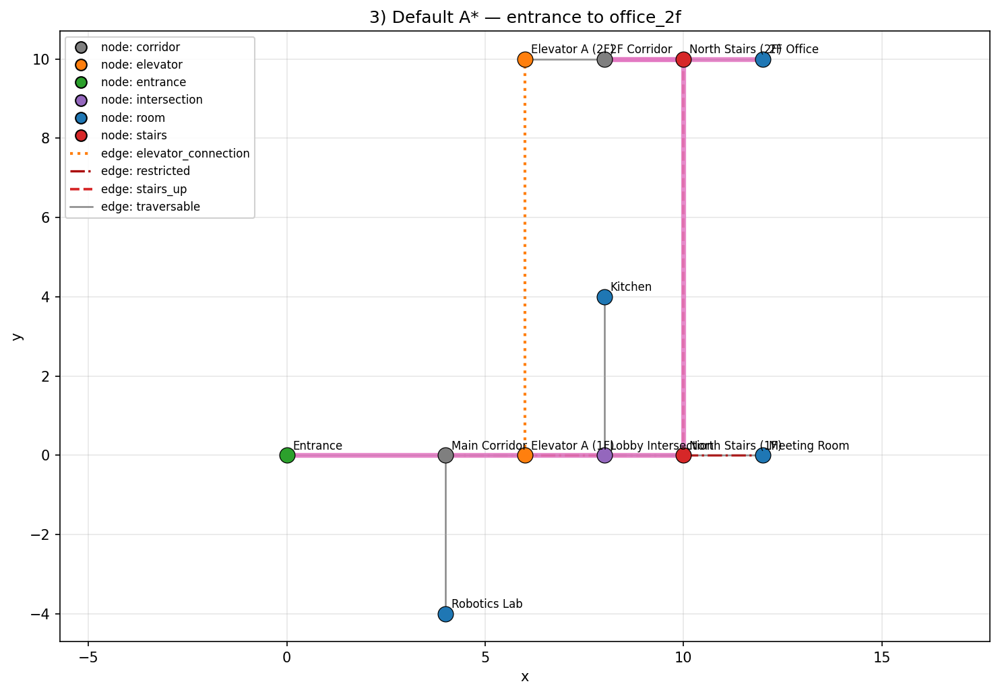
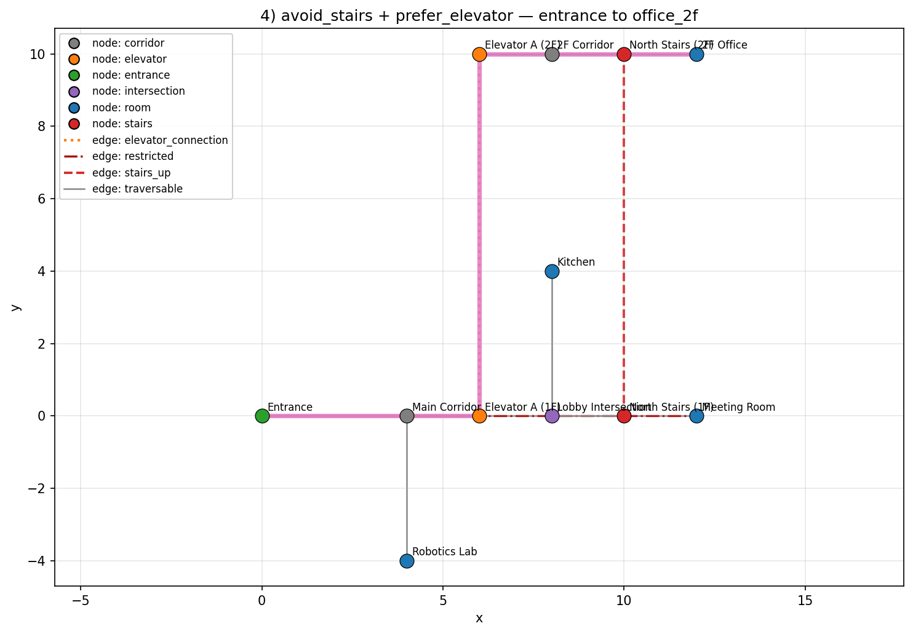

# semantic-toponav

[](https://github.com/rsasaki0109/semantic-toponav/actions/workflows/test.yml)
[](https://www.python.org/downloads/)
[](LICENSE)

Open-source robotics navigation built around **Semantic Topological Maps**.

`semantic-toponav` is the *global, semantic, graph-level* planning layer that
sits **above** dense metric maps and HD maps, and **below** any low-level
motion executor (Nav2, Autoware, MPPI, learned policies, ...).

It explores the next abstraction layer for robot navigation:

- semantic topological map
- graph-based navigation
- semantic waypoint planning
- memory-oriented navigation
- navigation for embodied AI

## What this project *is*

A small, readable Python core that:

- defines an explicit semantic topology graph (nodes, edges, semantic types)
- loads/saves graphs as YAML or JSON
- plans routes with Dijkstra and A*
- supports semantic-aware routing (avoid restricted, avoid stairs, prefer elevator, ...)
- converts a node path into a list of semantic waypoints
- ships a CLI for validation, planning, and waypoint generation
- ships a ROS2 adapter package skeleton for integration (Nav2 etc.)

## What this project is *not*

It deliberately does **not** include:

- low-level control (MPC, MPPI)
- obstacle avoidance
- SLAM
- dense occupancy planning
- behavior trees

Those should be integrated through existing systems (Nav2, Autoware, custom local planners).
The split is:

| Layer | Responsibility | Owned by |
|------|---------------|-----------|
| Global semantic-topological planning | *where* and *why* | this repository |
| Local motion execution | *how to move locally* | Nav2 / MPPI / policy |

## Quick start

```bash
pip install -e .
```

Generate a path from the bundled office example:

```bash
semantic-toponav validate      examples/indoor_office.yaml
semantic-toponav plan          examples/indoor_office.yaml entrance meeting_room
semantic-toponav waypoints     examples/indoor_office.yaml entrance office_2f --avoid-stairs --prefer-elevator
semantic-toponav describe-path examples/indoor_office.yaml entrance office_2f --avoid-stairs --prefer-elevator
```

The `describe-path` subcommand renders the plan as numbered, edge-aware
step-by-step instructions (e.g. "Take the elevator from Elevator A (1F)
to Elevator A (2F)", plus an explicit "Floor change: 1 -> 2" call-out)
on top of `plan` / `waypoints`.

Or run the full demo (shows how semantic costs change the route):

```bash
python examples/run_indoor_demo.py
```

New to the library? The [**three-floor tutorial**](docs/tutorial.md)
walks through the full workflow end-to-end — load, plan, customize
costs, emit waypoints, and visualize — against the bundled multi-floor
office graph.

## Occupancy grid → topology

A skeletonization-based converter turns a 2D occupancy grid into a topology
graph automatically. Endpoints become `endpoint` nodes; junctions become
`intersection` nodes; everything in between becomes `corridor` edges with
cost proportional to skeleton length.

```bash
pip install -e '.[viz,map]'
python examples/occupancy_to_topology.py
```

```python
import numpy as np
from semantic_toponav.conversion import topology_from_occupancy

grid = np.zeros((30, 60), dtype=bool)
grid[8:11, 4:55] = True       # horizontal corridor
grid[22:25, 4:55] = True      # second horizontal corridor
grid[8:25, 12:14] = True      # vertical link
graph = topology_from_occupancy(grid, resolution=0.25)
```

| occupancy grid + auto-generated topology | planned path overlay |
|-----------------------------------------|----------------------|
|  |  |

## Dynamic edge availability

Block specific edges or whole edge types at plan time without mutating the
graph. Useful for runtime state — "this corridor is closed for cleaning",
"the freight elevator is down" — that should affect *this* plan but not
the next one.

```python
from semantic_toponav.planner import (
    plan_astar, block_edges, block_edge_types, compose_costs, prefer_elevator,
)

# Plan as if the freight elevator and one stairwell were unusable.
path = plan_astar(
    graph, "entrance", "exec_office_3f",
    cost_fn=compose_costs(
        prefer_elevator,
        block_edges(["elevator_link_freight"]),
        block_edge_types({"stairs_up"}),
    ),
)
```

```bash
semantic-toponav plan multi_floor_office.yaml entrance exec_office_3f \
    --block-edge-type stairs_up \
    --block-edge e_corridor_2f_to_office_2f
```

Both flags are repeatable. A blocked edge returns `math.inf` from the cost
function and `NoPathError` is raised if blocking removes the last route.

### Time-of-day restrictions

Attach a `closed_during` property to an edge (or a node — closure
propagates to its incident edges) listing recurring HH:MM windows
when it's unavailable. An interval whose end is `<=` start wraps
midnight, so `["22:00", "06:00"]` is interpreted as the overnight
window.

```yaml
edges:
  - id: corridor_clean
    source: lobby
    target: corridor_main
    type: traversable
    properties:
      closed_during: [["14:00", "15:00"]]   # cleaning window
nodes:
  - id: kitchen
    label: Kitchen
    type: room
    properties:
      closed_during: [["22:00", "06:00"]]    # overnight
```

```bash
semantic-toponav plan office.yaml entrance kitchen --at-time 23:30
semantic-toponav plan office.yaml entrance meeting_room --at-time 14:30
```

```python
from semantic_toponav.planner import plan_astar, time_aware

path = plan_astar(graph, "entrance", "kitchen",
                  cost_fn=time_aware(graph, at_time="23:30"))
```

`time_aware` composes with the other cost functions via `compose_costs`.

## Multi-floor navigation

When nodes carry a `floor` property, three additional cost helpers and one
A* heuristic become available:

```python
from semantic_toponav.planner import (
    plan_astar, floor_change_penalty, prefer_floor, same_floor_only,
    floor_aware_heuristic, compose_costs, prefer_elevator,
)

graph = load_graph("examples/multi_floor_office.yaml")

# Stay on floor 1 unless absolutely necessary.
path = plan_astar(graph, "entrance", "exec_office_3f",
                  cost_fn=floor_change_penalty(graph, penalty=50))

# Strictly within-floor planning.
path = plan_astar(graph, "kitchen_1f", "lab_1f",
                  cost_fn=same_floor_only(graph))

# Accessibility: prefer elevators with a floor-aware heuristic.
path = plan_astar(graph, "entrance", "exec_office_3f",
                  cost_fn=compose_costs(prefer_elevator),
                  heuristic_fn=floor_aware_heuristic(floor_height=2.0))
```

The same flags are wired into the CLI: `--prefer-floor N`,
`--floor-change-penalty P`, `--same-floor-only`.

```bash
python examples/run_multi_floor_demo.py
```



## Trajectory log → topology

When you don't have an occupancy grid but you do have logs of where the
robot went (or where users / pedestrians walked), you can induce a
topology directly from those tracks. Points are clustered greedily; each
dense cluster becomes a node; consecutive cluster transitions become
edges with a `traversal_count` property — higher counts mark routes the
robot took repeatedly.

```python
from semantic_toponav.conversion import topology_from_trajectories

graph = topology_from_trajectories(
    [traj_a, traj_b],   # each traj is a sequence of (x, y)
    eps=0.5,            # cluster radius in meters
    min_samples=3,      # drop sparser clusters as noise
)
```

```bash
python examples/trajectory_to_topology.py
```



Trajectories can also be loaded from CSV (stdlib only, no pandas):

```python
from semantic_toponav.conversion import load_trajectories_from_csv

trajs = load_trajectories_from_csv(
    "examples/sample_trajectories.csv",
    x_column="x",
    y_column="y",
    trajectory_column="trajectory_id",   # grouping column, optional
)
```

Both header-based (`x`, `y`, `trajectory_id`) and headerless / positional
(integer column indices) layouts are supported. Run
`python examples/load_csv_demo.py` for an end-to-end demo:



### Loading trajectories directly from a rosbag2 recording

If you have a ROS2 environment sourced, you can skip the CSV step
entirely and read trajectories straight out of a `ros2 bag record` output:

```python
from semantic_toponav.conversion import (
    load_trajectories_from_rosbag,
    topology_from_trajectories,
)

trajs = load_trajectories_from_rosbag("my_run")    # directory or .db3 file
graph = topology_from_trajectories(trajs, eps=0.5, min_samples=3)
```

Supported topic types are `nav_msgs/msg/Odometry`,
`geometry_msgs/msg/PoseStamped`, and
`geometry_msgs/msg/PoseWithCovarianceStamped`; each topic becomes one
trajectory in the returned list. The loader imports `rosbag2_py` and
`rclpy` lazily, so the rest of the package keeps working without ROS2
installed.

### Loading ROS map_server bundles

`semantic-toponav` can load the standard `map_server` YAML + PGM/PNG/BMP
pair used by ROS Nav2:

```python
from semantic_toponav.conversion import load_occupancy_map, topology_from_occupancy

m = load_occupancy_map("examples/sample_map.yaml")
graph = topology_from_occupancy(m.free_mask, resolution=m.resolution, origin=m.origin)
```

`negate`, `free_thresh`, and `occupied_thresh` are honored. The bundled
`examples/sample_map.{yaml,pgm}` is small enough to skim and produces a
topology with rooms, a main corridor, and a planned route:

```bash
python examples/load_map_demo.py
```



## Visualization

Install the optional viz extra and use the `plot` subcommand or the Python helper:

```bash
pip install -e '.[viz]'

semantic-toponav plot examples/indoor_office.yaml \
    --start entrance --goal office_2f \
    --avoid-stairs --prefer-elevator \
    --save route.png
```

```python
from semantic_toponav.visualization import plot_graph
plot_graph(graph, path=path, save_path="route.png")
```

Below: same graph, two different cost configurations.

| Default A* | `avoid_stairs + prefer_elevator` |
|------------|-----------------------------------|
|  |  |

### Interactive web viewer

For exploration in a browser, install the `viz_web` extra (pulls in
[pyvis](https://pyvis.readthedocs.io/)) and write out a self-contained
HTML page:

```bash
pip install -e '.[viz_web]'

# From the CLI:
semantic-toponav viewer examples/multi_floor_office.yaml \
    --start entrance --goal exec_office_3f --prefer-elevator \
    --output viewer.html
xdg-open viewer.html

# Or from Python (via the bundled demo):
python examples/web_viewer_demo.py     # writes examples/multi_floor_viewer.html
```

```python
from semantic_toponav.visualization import save_interactive_html

save_interactive_html(graph, "viewer.html", path=plan)
```

Nodes are draggable, hovering surfaces type/cost/property tooltips, and
the highlighted path is overlaid in pink. The generated file is fully
offline — open it on any machine without re-running Python.

## Graph schema (v1)

```yaml
version: 1
metadata:
  name: indoor_office
  frame_id: map
nodes:
  - id: entrance
    label: Entrance
    type: entrance
    pose: {x: 0.0, y: 0.0, yaw: 0.0, frame_id: map}
    properties: {}
edges:
  - id: entrance_to_corridor
    source: entrance
    target: corridor_main
    type: traversable
    cost: 1.0
    bidirectional: true
    properties: {}
```

Node `type` examples: `corridor`, `room`, `intersection`, `elevator`, `stairs`, `entrance`.
Edge `type` examples: `traversable`, `stairs_up`, `stairs_down`, `elevator_connection`,
`restricted`, `one_way`.

`pose` is optional. Without it, A* degrades to Dijkstra.

## Python API

```python
from semantic_toponav.graph.serialization import load_graph
from semantic_toponav.planner import (
    plan_astar, avoid_restricted, avoid_stairs, prefer_elevator, compose_costs,
)
from semantic_toponav.waypoint import path_to_semantic_waypoints

graph = load_graph("examples/indoor_office.yaml")

path = plan_astar(
    graph, "entrance", "office_2f",
    cost_fn=compose_costs(avoid_stairs, prefer_elevator),
)
for wp in path_to_semantic_waypoints(graph, path):
    print(wp.instruction)
```

### Programmatic graph construction

For small graphs or unit tests, the fluent `GraphBuilder` is usually less
ceremony than hand-writing dataclasses:

```python
from semantic_toponav.graph import GraphBuilder
from semantic_toponav.planner import plan_astar

graph = (
    GraphBuilder()
    .node("entrance", type="entrance", x=0, y=0)
    .node("corridor", type="corridor", x=2, y=0)
    .node("lab",      type="room",     x=4, y=0, label="Robotics Lab")
    .connect("entrance", "corridor", "lab")           # chain edges in one call
    .build()
)

path = plan_astar(graph, "entrance", "lab")
```

`x=`/`y=` (and optional `yaw`/`frame_id`) build a `Pose2D` inline; `connect()`
lays edges through a sequence of node ids; `edge()` auto-generates an id
like `"<source>__<target>"` when one isn't passed.

## Semantic queries

Translate natural-language-style intents ("nearest elevator", "any room on
floor 2") into concrete graph operations:

```python
from semantic_toponav.query import (
    find_nodes, nearest_node_by_pose, nearest_node_by_graph_distance,
)

elevators = find_nodes(graph, type="elevator")
office_2f_nodes = find_nodes(graph, properties={"floor": 2})

# Euclidean nearest (no path required).
nearest = nearest_node_by_pose(graph, (0.0, 0.0), type="elevator")

# Graph-distance nearest, with shortest path included.
node, path = nearest_node_by_graph_distance(graph, "entrance", type="room")
```

```bash
semantic-toponav find    examples/indoor_office.yaml --type elevator
semantic-toponav nearest examples/indoor_office.yaml --from-node entrance --type room
semantic-toponav nearest examples/indoor_office.yaml --from-pose 0 0 --type elevator
```

### Embedding-based retrieval

Nodes can carry an arbitrary embedding vector under
`properties["embedding"]`. Attach CLIP / SigLIP / sentence-encoder vectors
ahead of time and `semantic-toponav` will rank candidates by cosine
similarity — no model dependency in the core:

```python
from semantic_toponav.query import (
    find_nodes_by_embedding, nearest_node_by_embedding,
)

# ... attach node.properties["embedding"] = [...]  ahead of time ...

matches = find_nodes_by_embedding(graph, query_vec, top_k=5, type="room")
goal = nearest_node_by_embedding(graph, query_vec, type="room")
```

`python examples/embedding_demo.py` runs a self-contained demo using
deterministic toy embeddings.

### Visit-history memory

A small memory layer records when each node was last visited, then lets
the planner reason over that history. Visit data lives in
`node.properties` so it round-trips through YAML/JSON with no schema
change.

```python
from semantic_toponav.memory import (
    record_path, prefer_unvisited, prefer_familiar, avoid_recently_visited,
)
from semantic_toponav.planner import plan_astar

# Record the path the robot actually traversed.
record_path(graph, executed_path)

# Bias the next plan toward unexplored nodes (coverage / patrol).
path = plan_astar(graph, "entrance", "lab", cost_fn=prefer_unvisited(graph))

# Or retrace a familiar route, or avoid nodes touched in the last minute.
plan_astar(graph, "entrance", "lab", cost_fn=prefer_familiar(graph))
plan_astar(
    graph, "entrance", "lab",
    cost_fn=avoid_recently_visited(graph, within_seconds=60.0),
)
```

`python examples/memory_demo.py` walks through coverage, retrace, and
time-decay scenarios on the multi-floor example graph.

The same history layer is also addressable from the shell:

```bash
# Record what the robot just traversed, then plan again preferring new ground.
semantic-toponav record-path examples/multi_floor_office.yaml \
    entrance corridor_1f lobby_1f stairs_1f stairs_2f stairs_3f corridor_3f exec_office_3f \
    --in-place
semantic-toponav plan examples/multi_floor_office.yaml entrance exec_office_3f \
    --prefer-unvisited --visited-multiplier 10
semantic-toponav history examples/multi_floor_office.yaml
semantic-toponav clear-history examples/multi_floor_office.yaml --in-place
```

## CLI

```text
# Planning
semantic-toponav validate  GRAPH
semantic-toponav plan      GRAPH START GOAL [--algorithm astar|dijkstra] [--avoid-restricted]
                                            [--avoid-stairs] [--prefer-elevator]
                                            [--prefer-unvisited [--visited-multiplier M]]
                                            [--prefer-familiar [--familiar-multiplier M]]
                                            [--avoid-recent SECONDS [--recent-multiplier M] [--now TS]]
                                            [--at-time HH:MM] [--format text|json]
semantic-toponav waypoints     GRAPH START GOAL [...same options...]
semantic-toponav describe-path GRAPH START GOAL [...same options...]
semantic-toponav plot          GRAPH [--start S --goal G] [--avoid-*] [--save FILE] [--show]
                                                           [--edge-ids] [--title STR]

# Visit history (write to stdout by default; pass --in-place or --out FILE to persist)
semantic-toponav record-visit  GRAPH NODE_ID [--now TS] [--in-place | --out FILE]
semantic-toponav record-path   GRAPH NODE_ID... [--now TS] [--in-place | --out FILE]
semantic-toponav clear-history GRAPH [NODE_ID...] [--in-place | --out FILE]
semantic-toponav history       GRAPH [NODE_ID...] [--all]

# Editing (write to stdout by default; pass --in-place or --out FILE to persist)
semantic-toponav inspect   GRAPH [--nodes] [--edges] [--type T]
semantic-toponav add-node  GRAPH ID --type T [--label L] [--x X --y Y [--yaw R]]
                                             [--prop KEY=VALUE ...] [--in-place | --out FILE]
semantic-toponav add-edge  GRAPH SRC TGT --type T [--id ID] [--cost C] [--one-way]
                                                  [--prop KEY=VALUE ...] [--in-place | --out FILE]
semantic-toponav rm-node   GRAPH ID [--in-place | --out FILE]   # cascades to incident edges
semantic-toponav rm-edge   GRAPH ID [--in-place | --out FILE]

# Semantic queries
semantic-toponav find      GRAPH [--type T] [--label-contains S] [--label-equals S]
                                 [--prop KEY=VALUE ...] [--format text|json]
semantic-toponav nearest   GRAPH (--from-pose X Y | --from-node ID)
                                 [...same filter flags as `find`...]
semantic-toponav resolve   GRAPH "natural language goal text"
                                 [--top-k N] [--format text|json]
```

`resolve` is a deterministic (no-LLM) free-text node lookup. It
tokenizes the query, parses floor references (`2F` / `floor 2` /
`second floor` / `2nd floor`), and ranks nodes by label / type token
overlap plus floor match — useful as the offline floor under a later
LLM resolver.

```bash
semantic-toponav resolve examples/indoor_office.yaml "the kitchen"
semantic-toponav resolve examples/indoor_office.yaml "second floor office"
```

Build a tiny graph from scratch:

```bash
echo 'version: 1
metadata: {name: scratch}
nodes: []
edges: []' > scratch.yaml

semantic-toponav add-node scratch.yaml a --type entrance --x 0 --y 0 --in-place
semantic-toponav add-node scratch.yaml b --type corridor --x 2 --y 0 --in-place
semantic-toponav add-node scratch.yaml c --type room     --x 4 --y 0 --in-place
semantic-toponav add-edge scratch.yaml a b --type traversable --in-place
semantic-toponav add-edge scratch.yaml b c --type traversable --in-place
semantic-toponav waypoints scratch.yaml a c
```

## ROS2 integration

The core Python package is ROS-independent. The ROS2 wrapper lives under
`ros2/semantic_toponav_ros/` and the custom message definitions under
`ros2/semantic_toponav_msgs/`. The wrapper ships three nodes:
`graph_loader` (publishes the validated graph as a latched `TopologyGraph`),
`waypoint_publisher` (plans and publishes semantic waypoints in JSON or
typed form), and `nav2_demo` (a worked example that forwards semantic
waypoints to Nav2's `NavigateThroughPoses`). See
[`ros2/README.md`](ros2/README.md) for the adapter design, the JSON vs
typed-message comparison, and the Nav2 integration boundary.

## Project status

This is the MVP. Things explicitly out of scope for the first version
include a behavior-tree Nav2 plugin, occupancy-to-topology conversion, VLM
labeling, and CLIP embeddings. See
[`docs/decisions.md`](docs/decisions.md) for the reasoning and
[`docs/experiments.md`](docs/experiments.md) for future directions.

The JSON wire format produced by `waypoint_publisher_node` and
`SemanticWaypoint.to_dict()` is documented (and v1-stable) under
[`docs/waypoint_schema.md`](docs/waypoint_schema.md), with a matching
JSON Schema in [`schemas/`](schemas/).

## Tests

```bash
pytest -q
```

## License

Apache-2.0.
